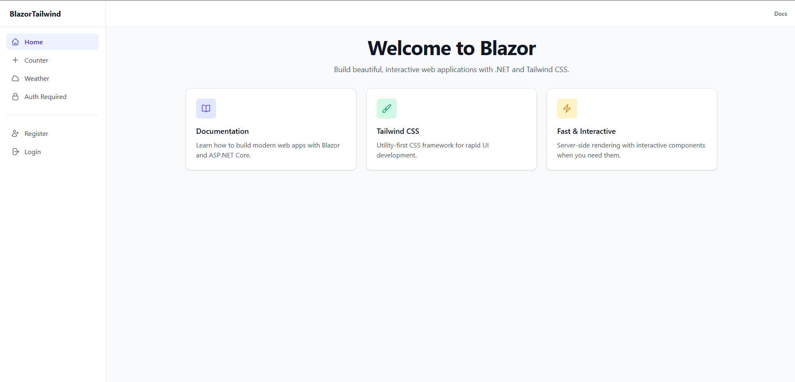
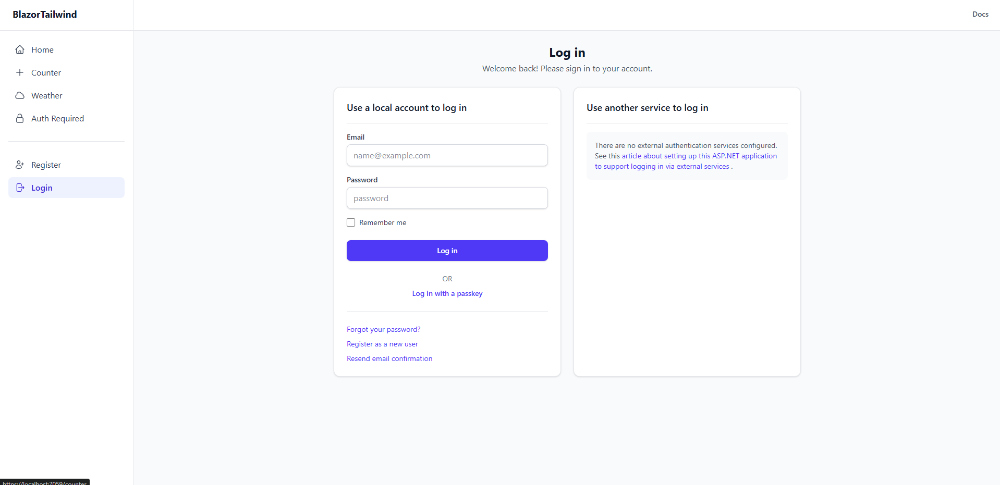

# BlazorTailwind

Blazor server webapp template preconfigured with Tailwind V4 and Identity for authentication.





## Why Use This Template?

Setting up Tailwind CSS in a Blazor project with proper configuration can be time-consuming and error-prone. Additionally, updating ASP.NET Core Identity's default Bootstrap classes to work with Tailwind involves a significant amount of boilerplate code. This template provides a ready-to-use project with:

- **Pre-configured Tailwind CSS v4**: Skip the slow configuration process and start styling immediately
- **Identity with Tailwind**: All Identity pages and components already styled with Tailwind classes
- **Beautiful UI out of the box**: Naturally beautiful interface using Tailwind v4's modern design system
- **Save hours of setup time**: Jump straight into building your application

## Features

- ✨ Blazor Web App (.NET 10.0)
- 🎨 Tailwind CSS v4.x pre-configured
- 🔐 ASP.NET Core Identity for authentication
- 📦 Ready to use as a dotnet template

## Getting Started

### Option 1: Clone the Repository

```bash
git clone https://github.com/n4sser77/BlazorTailwind.git
cd BlazorTailwind/BlazorWebAppTailwind
dotnet restore
npm install
dotnet run
```

### Option 2: Fork the Repository

1. Click the "Fork" button at the top right of this repository
2. Clone your forked repository:

   ```bash
   git clone https://github.com/YOUR_USERNAME/BlazorTailwind.git
   ```

3. Follow the same steps as Option 1 to run the project

### Option 3: Export as Visual Studio Project Template

1. Open the solution in Visual Studio
2. Go to **Project** → **Export Template**
3. Select **Project Template**
4. Choose the **BlazorWebAppTailwind** project
5. Follow the wizard to create your template
6. The template will be available in Visual Studio's **New Project** dialog

### Option 4: Install as a dotnet new Template (Recommended)

#### Install from Local Directory

```bash
# Clone the repository
git clone https://github.com/n4sser77/BlazorTailwind.git
cd BlazorTailwind

# Install the template
dotnet new install .
```

#### Use the Template

Once installed, create a new project using the template:

```bash
# Create a new project
dotnet new blazortailwind -n MyBlazorApp

# Navigate to the project directory
cd MyBlazorApp/BlazorWebAppTailwind

# Restore dependencies
dotnet restore
npm install

# Run the application
dotnet run
```

#### Template Options

```bash
# Specify a different target framework
dotnet new blazortailwind -n MyBlazorApp --Framework net9.0
```

#### Uninstall the Template

```bash
dotnet new uninstall BlazorTailwind.Template
```

#### Future: Install from NuGet (Coming Soon)

Once deployed to NuGet, you'll be able to install the template using:

```bash
dotnet new install BlazorTailwind.Template
```

## Development

### Prerequisites

- .NET 10.0 SDK or later
- Node.js 20.x or later

### Building the Project

```bash
cd BlazorWebAppTailwind
dotnet build
```

### Running Tests

```bash
cd BlazorWebAppTailwind
dotnet test
```
